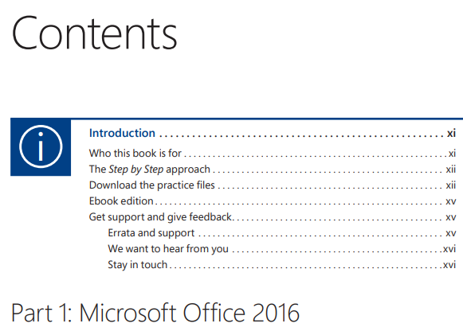
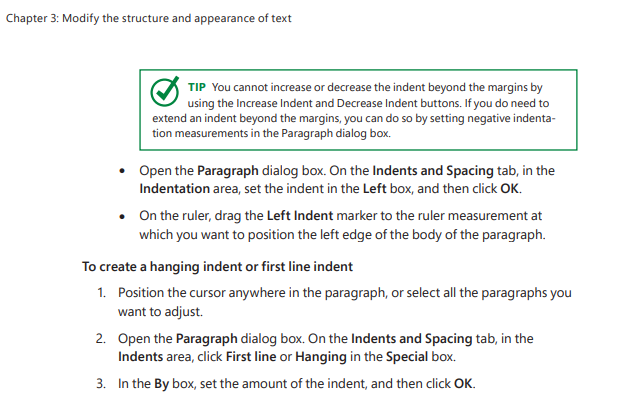
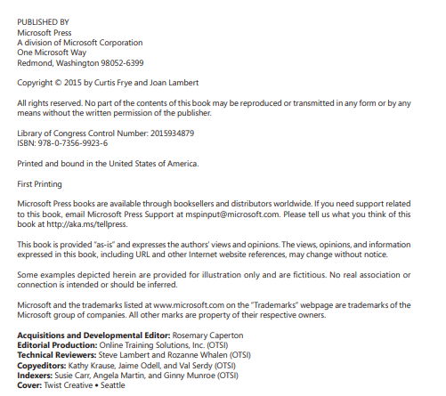
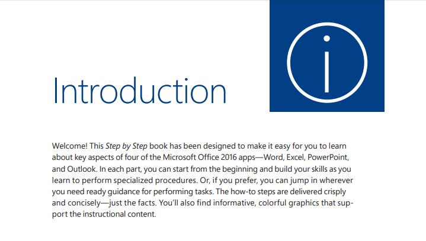
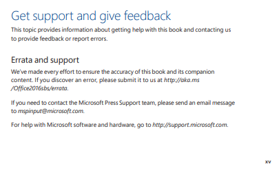

 

# User Manual Nedir?
**Kullanıcı Klavuzu:**Ürünün doğru ve güvenli bir şekilde kullanılabilmesi için, ürün ile ilgili teknik özellikler ve işletme bilgileri gibi gerekli bilgilerin kullanıcıya verilmesi amacıyla hazırlanan resim, fotoğraf ve açıklayıcı metinlerden oluşan dökümandır.

# User Manual'in Faydaları

1-Uygulamanın nasıl kullanılacağını öğretir.

2-Destek maliyetlerini düşürür.

3-Şirketin piyasa değerini ve vizyonunu artırır.

# User Manual Yazarken Dikkat Edilecekler

1-Hitap edilen kesime göre yazılmalıdır.

2-Genel terimler ve anlaşılabilecek teknik terimler kullanılmalıdır.

3-Kullanım Klavuzu, yazılımın nasıl kullanılabileceğine dair mantık sırasına sokulmalıdır.

4-Birden çok kişinin gözden geçirmesiyle yazım ve mantık hataları giderilmelidir.

5-Destekleyici görseller kullanılmalıdır.

6-**Highlighting:** Önemli yerler araçlarla vurgulanmalıdır.

7-Yazı formatında bir stantart uygulanmalıdır.

***Örnek User Manual kapağı***

# User Manual Nasıl Hazırlanır?

***Kullanma kılavuzlarının tasarlanması sırasında;***

-Ne?

-Nerede?

-Nasıl?

-Ne zaman?

-Niçin?

-Kim tarafından?

sorularına cevap aranmalıdır.

## 1. Kullanım amacı ve kullanıcı kitlesi tanımlanır
İlk önce ürün açık şekilde tanımlanmalıdır.Ürünün versiyonu ya da tipi belirtildikten sonra, versiyonlar arasındaki değişiklikler kullanma kılavuzunda tanımlanmalı ve kullanıcının ikileme düşmesi önlenmelidir. Yazılımı kullanacak kitle göz önünde bulundurulmalıdır.Yazılım ilk defa mı kullanılacak? ya da yazılımı kullanmayı bilen fakat güncelleme, yedekleme, veri kurtarma vs. gibi işlemleri yapacak kullanıcılara göre mi yazılacak? Gerekirse anketlerle vs kullanıcıların görüşleri de değerlendirilmelidir.

***Not: Ayrıca bu bölümde sistem gereksinimleri de belirtilmelidir.  Örneğin;***

***Java 7.78 sürümü kurulu olmalıdır,***

***Windows 7 veya üstü işletim sistemi yüklü olmalıdır.***

**Örnek içindekiler sayfaları**

**Örnek: Who this book is for**

## 2. Uygun format seçilir
Bilginin tutarlı, anlaşılır bir şekilde kullanıcıya ulaşması için gerekli format seçilmelidir. Metinlerin biçimlendirilmesine, maddelerin hizalanmasına, yeterince resmi bir dil kullanılmasına , şablonların içeriğine vs. dikkat edilmelidir.
Ayrıca kullanma kılavuzlarındaki  yazı büyüklükleri 8-14 punto arasında olmalıdır. Ürün bilgilerinin yazıldığı zemin ile yazı rengi arasındaki kontrastın en az %70 olması sağlanmalıdır.
Renk seçimi sırasında uluslararası anlaşılırlığın sağlanabilmesi için ISO 3864 den yaralanılabilir.Burada dikkat edilmesi gereken bir husus ise, ortalama olarak erkeklerin %8’i, kadınların ise %0.5’i renk körüdür, yapılacak uyarılar , önemli noktalar sadece renk temeline dayandırılmamalıdır.

## 3. Çözülmesi gereken sorun tanımlanır.
Bir prosedürün nerede başlayıp nerede biteceği, kullanım sırasında ne tür sorunlarla karşılaşılabileceği tanımlanmalıdır. Gerekirse sorunlarla ilgili müşteri önerileri dikkate alınmalıdır.

## 4. Uygun giriş sayfası tasarlanır.
Minimalist bir başlık sayfası hazırlamak ve yaratıcı tasarıma fazla zaman ayırmamak gerekir.En önemli kısım, başlık sayfasında gerekli tüm bilgileri sağlamaktır. Herkes bunun bir kullanım kılavuzu olduğunu, kapsamını, kitlesini, misyonunu, sürümünü, yayın tarihini, yazarını vs. anlamalıdır.

## 5. Kullanıcı talimatları belirlenir
Kullanıcıların sorunlarla ilgili nasıl bir yöntem izlemesi gerektiği, nereye başvurması gerektiği vs. belirtilmeldir.

***Not:*** *User Manual ürünün tamamlayıcı bir parçasıdır.Olmaması ya da yeterli bir şekilde hazırlanmaması halinde yasal mevzuat tarafından ürün güvenliğinin yeterli olmadığı varsayılır.*

